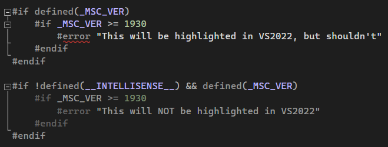

Pre-requisites:

- Install VS2022
- Install the optional `Microsoft.VisualStudio.Component.VC.14.29.16.11.x86.x64` (`MSVC v142 - VS 2019 C++ x64/x86 build tools (v14.29-16.11)`) component

How to reproduce:

- `cmake -B build -T v142`
- `cmake --open build`
- Navigate to the `main.cpp` file

Example:

